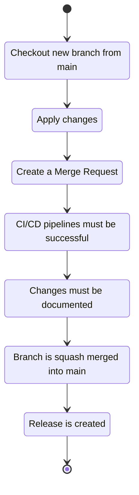

**Do you want to contribute ? Please do!**

* [How to help?](#how-to-help?)
    * [Report issues, propose features](#report-issues-propose-features)
    * [Solve problems](#solve-problems)
    * [Say thanks](#say-thanks)
* [Project workflow](#project-workflow)
    * [Environment](#environment)
    * [Development](#development)
    * [CI/CD](#ci/cd)

# How to help?
They are several ways to help and improve this project.

## Report issues, propose features
You think you found a bug ? You think something is missing out ? Check that it has not been [already reported](https://gitlab.com/flwgns-docker/seafile-client/-/issues). If it has not, [report it](https://gitlab.com/flwgns-docker/seafile-client/-/issues/new?issue).

## Solve problems
You can't wait for a problem to be solved ? Pick one from the [already reported problems](https://gitlab.com/flwgns-docker/seafile-client/-/issues) and solve it. It will be greatly appreciated!

## Say thanks
One great way to help is simply to say thanks. You can do that by [adding a star to the Docker Hub repository](https://hub.docker.com/r/flowgunso/seafile-client) or [just saying thanks in the project topic on Seafile's forum](https://forum.seafile.com/t/docker-client-to-sync-files-with-containers/8573).

# Project workflow
The ins and outs of the project, from setting up a local environment for developments to notifying users of changes.

To provide the different Seafile's client versions, the project rely on the [`seafile` package available throughout the different Debian versions][packages]. Check out [Debian Developer's Package Overview][ddpo] and [Debian Package Tracker][tracker] for in depth details regarding that package. 

[packages]: https://packages.debian.org/search?keywords=seafile-cli
[ddpo]: https://qa.debian.org/developer.php?login=team%2Bseafile%40tracker.debian.org
[tracker]: https://tracker.debian.org/pkg/seafile

The following state diagram describe essentially the project workflow for a release.

## Environment
The following is required to develop:
* Docker engine
* Bash
* Make

## Management

The project managemenet is mostly run through the Makefile.

The parameter `TARGET` define on which Debian version the instructions are run.

The following instructions are available:

### mock
Start the Docker Compose mock for a Seafile server.

### unmock
Start the Docker Compose mock for a Seafile server.

### client
Purge and start the client service on the Docker Compose mock for a Seafile server.

### logs
Continuously display the logs from the client service on the Docker Compose mock for a Seafile server.

### build
Build the Seafile Docker client image depending on the `TARGET`. 

### build-test
Build the Seafile Docker client test image depending on the `TARGET`.

### test
Run the Seafile Docker client test container.

### documents
Build the documentation for both Docker Hub and Seafile's forum.

### publish-images
Publish the Docker Seafile client image, properly tagged with the appropriate Seafile cliens versions.

### publish-documents
Publish the generated documentation on Docker Hub only

### save
Export the Seafile Docker client image as a tarball.

### load
Load the Seafile Docker client image from a tarball

## Pipelines

Pipelines are run either on merge requests or on commit tags.

The pipelines are divided into three stages:
* Build
* Test
* Release

Release jobs are obviously not run on merge requests.
